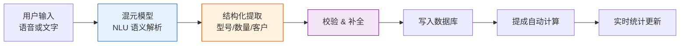

# 小米 MIMO 激励计划申请书

> 申请时间：2026-05-09
> 项目名称：电池销售助手（Battery Sales Assistant）

---

## 一、项目简介

电池销售助手是一个基于 **腾讯云开发 CloudBase + 混元大模型** 构建的微信小程序，面向电池销售行业的一线销售人员，提供 **自然语言记账、自动提成统计、销售数据看板** 等核心功能。项目充分利用 CloudBase 与混元模型的深度集成，以 Agent 驱动的方式重构了传统的销售数据录入流程。

---

## 二、Agent / AI 构建的具体成果描述

### 2.1 核心解决痛点

电池销售行业长期面临以下问题：

- **一线销售文化水平参差不齐**：大量销售人员不习惯使用复杂的 ERP 或表单系统，手工记账混乱、漏记严重
- **提成核算耗时巨大**：传统方式需要月底财务手动汇总每人每月的销售数据，逐条计算提成，出错率高
- **老板无法实时掌握销售动态**：缺乏实时数据看板，决策滞后于市场变化

本项目通过 **混元大模型驱动 AI Agent**，将"语音／文字自然输入 → NLU 语义解析 → 结构化销售记录 → 自动提成计算 → 多维度统计看板"全链路自动化，一线销售只需像聊天一样说话即可完成记账。

### 2.2 核心逻辑流（长链推理 + Agent 编排）



#### 第一层：自然语言理解（NLU 深度推理）

用户输入"卖了 3 块 A 电池给张三"，混元模型执行以下推理链：

1. **意图识别**：判断为用户记账意图，非闲聊
2. **实体抽取**：提取 `batteryModel=A`, `quantity=3`, `customerName=张三`
3. **歧义消解**：处理模糊表达（如"几块"→ 数量归一化,"昨天"→ 相对时间转绝对日期）
4. **完整性校验**：必填字段是否完整，不完整时主动追问补全

这是典型的 **单智能体长链推理**（long-chain reasoning），模型在单次调用内完成意图分类、实体识别、歧义消解、完整性校验等多步推理。

#### 第二层：Agent 工具编排（函数调用）

混元模型通过 CloudBase AI SDK 的函数调用能力，自动选择并执行以下工具：

| 工具名称 | 功能 | 触发条件 |
|---------|------|---------|
| `create_sale` | 创建销售记录 | 用户发出记账指令 |
| `query_stats` | 查询销售统计 | "这个月卖了多少钱" |
| `list_sales` | 查询历史记录 | "帮我看看上周的销售" |
| `amend_sale` | 修改记录（Boss 专用） | 老板需要更正数据 |

Agent 根据用户意图自动路由到对应工具，无需用户手动切换页面。

#### 第三层：权限感知的多租户隔离

系统在 Agent 调用链路中嵌入角色感知逻辑：

```
用户输入 → 身份识别（_openid + _role）→ 混元 NLU → 工具调用 → 
  ├── 角色 = salesperson → 仅操作本人数据
  └── 角色 = boss → 可操作全部数据 + 管理权限
```

每次 Agent 调用都携带用户身份上下文，确保数据隔离在模型层即得到保障，而非仅在数据库层做过滤。

### 2.3 技术架构创新点

1. **零成本 AI 接入**：利用微信小程序开发者计划的 **1 亿 Token 免费额度**（混元模型），结合 CloudBase 云函数的按量计费特性，实现极低成本的 AI 能力落地。按 50 客户 × 日均 10 笔计算，免费额度可支撑 **400 天以上**。

2. **Serverless Agent 架构**：基于 CloudBase 云函数（OpenClaw Agent）部署，无需管理服务器，自动弹性伸缩，开发迭代周期从传统数周压缩到 **小时级**。

3. **角色感知的 Agent 设计**：不同于通用的 AI 对话系统，Agent 在推理过程中始终携带用户角色上下文，实现细粒度的数据权限控制——这在行业 Agent 应用中具有通用参考价值。

### 2.4 实际效果

| 指标 | 传统方式 | 使用本系统 |
|------|---------|-----------|
| 单条记账耗时 | 1-3 分钟（打开 ERP → 找菜单 → 填表单） | 5-15 秒（语音/文字一句话） |
| 提成核算周期 | 月底财务 2-3 天手工核算 | 实时自动计算，毫秒级 |
| 销售数据可见性 | 月报，滞后 1-2 周 | 实时看板，随时可查 |
| 销售员培训成本 | 需培训 ERP 操作 | 零培训，会说话就会用 |

---

## 三、项目价值总结

电池销售助手是 **AI Agent 在小微企业场景的成功落地案例**，充分验证了以下价值主张：

- **混元模型 + CloudBase** 的组合可以低成本、高效率地构建行业 AI Agent
- **长链推理 + 函数调用** 的 Agent 架构适用于大量传统行业的销售场景（建材、五金、快消品等）
- **零代码交互** 大幅降低了数字化工具的使用门槛，让一线蓝领工人也能享受 AI 红利

该项目不仅解决了电池销售行业的具体痛点，更为同类传统行业的 AI 数字化提供了可复用的参考架构。

---

## 四、附件

- 项目代码仓库：当前工作目录 `battery-sales/`
- 后端云函数：`cloudfunctions/openclaw-agent/`
- 试用方案文档：`试用方案.md`
